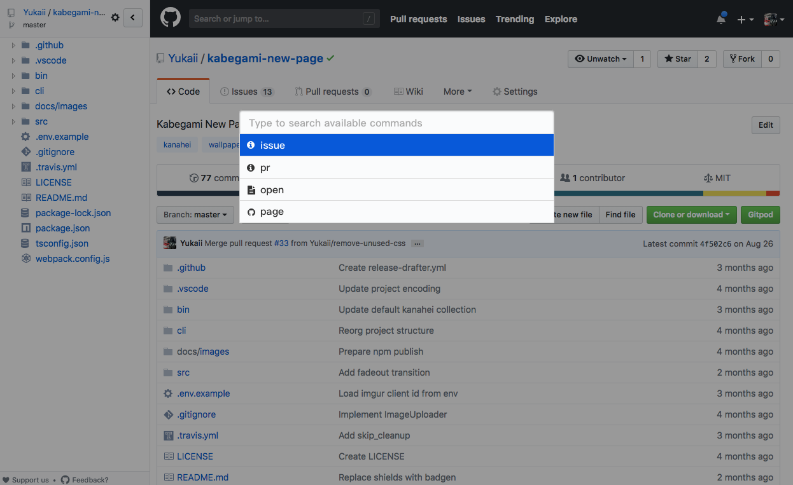
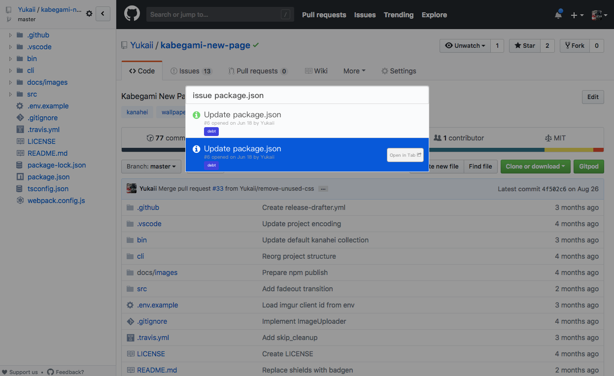
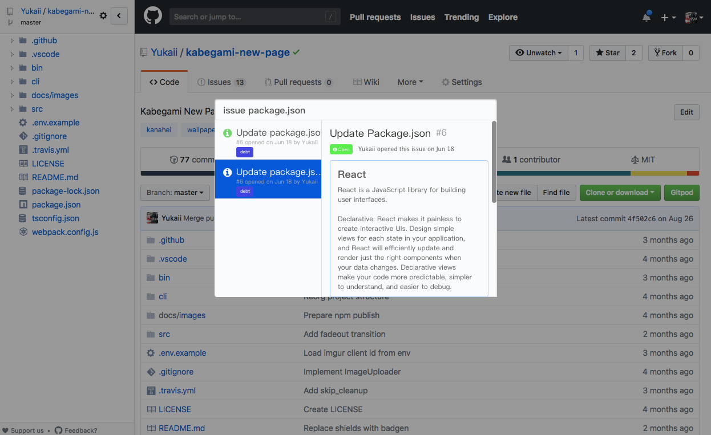

# GitHub Command Palette

**Current status: Work in progress**

## Concept

GitHub doesn't provide a global ui for searching:

- Issues & PRs
- File
- Different pages, like settings, profiles, wikis, etc

Command Palette is an efficient UX to search through different context, so I designed this extension.

Here are some ui concepts done in Sketch:

## LICENSE

MIT
